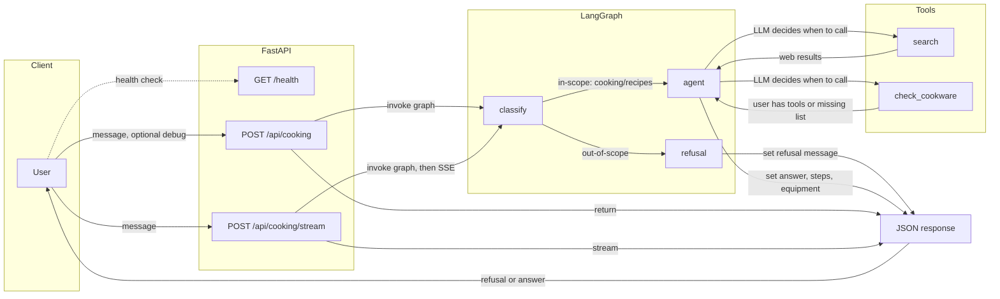

# PressW — LLM-Powered Cooking & Recipe Q&A

Monorepo for the PressW intern technical assessment: **AI-powered recipe chatbot** (LangChain + LangGraph) with a **Next.js** chat frontend.

## Structure

```
.
├── backend/                    # FastAPI + LangGraph
│   ├── main.py                 # API entry point, /health, POST /api/cooking, POST /api/cooking/stream
│   ├── llm.py                  # LangChain chat model (Groq); all LLM access goes through here
│   ├── graphs/                 # LangGraph nodes and compiled graph
│   │   ├── state.py            # CookingState TypedDict
│   │   ├── classify.py         # In-scope vs out-of-scope classification node
│   │   ├── refusal.py          # Out-of-scope refusal node
│   │   ├── agent.py            # Cooking Q&A agent node (LLM + tools loop)
│   │   └── graph.py            # build_cooking_graph(), classify → refusal | agent
│   ├── tools/                  # Tools used by the agent
│   │   ├── search.py           # DuckDuckGo web search
│   │   └── cookware.py         # check_cookware (user equipment list)
│   ├── schemas/                # Pydantic request/response models
│   │   └── cooking.py          # CookingRequest, CookingResponse
│   ├── scripts/
│   │   └── export_openapi.py   # Export OpenAPI schema to repo root openapi.json
│   ├── tests/                  # Pytest: refusal, classify, cookware, agent (mocked LLM)
│   ├── requirements.txt
│   ├── Dockerfile
│   └── pyproject.toml          # Ruff config
├── frontend/                   # Next.js 15 App Router + TypeScript + Tailwind
│   ├── app/
│   │   ├── layout.tsx
│   │   └── page.tsx            # Chat page (messages, streamCookingMessage)
│   ├── components/
│   │   ├── chat/               # ChatLayout, MessageList, MessageBubble, ChatInput, etc.
│   │   └── ui/                 # Button, Input, ScrollArea (Radix-based)
│   ├── lib/
│   │   ├── api.ts              # sendCookingMessage, streamCookingMessage, Zod + generated types
│   │   ├── api-types.generated.ts   # Generated from openapi.json (npm run generate:api-types)
│   │   └── utils.ts            # cn() for class names
│   ├── package.json
│   ├── Dockerfile
│   └── tsconfig.json
├── openapi.json                # OpenAPI 3.1 schema (regenerate via backend/scripts/export_openapi.py)
├── docker-compose.yml          # backend + frontend services, healthcheck, env
├── .env.example
├── .editorconfig
├── .prettierrc
├── .github/workflows/ci.yml    # Backend: Ruff, pytest; frontend: lint, build
└── README.md
```

## Architecture (high-level)

The diagram below summarizes the flow from user message to response; the arrows are the directed edges (client → API → classify → refusal or agent → tools → response).



**Node summary**

| Node | Role |
|------|------|
| **classify** | Single LangGraph node: LLM (via LangChain) labels the query as in-scope (cooking/recipes) or out-of-scope. No model-specific SDKs; all calls go through LangChain. |
| **refusal** | Deterministic node: returns a short, polite message when the query is not about cooking. |
| **agent** | LangGraph node: LLM with bound tools. The model decides when to call **search** (DuckDuckGo) or **check_cookware** (hardcoded list). Loops on tool calls until a final answer, then returns steps/tips and equipment check. |
| **search** | External info tool: web search (no API key). Used for recipes and cooking lookups. |
| **check_cookware** | Compares required equipment to the user’s list; tells the agent if something is missing. |
| **JSON response** | Final payload: `refusal` (out-of-scope) or `answer` (cooking); optional `reasoning_chain` when `debug=true`. Returned by POST /api/cooking or streamed by POST /api/cooking/stream. |

The frontend at http://localhost:3000 is the chat UI that calls this backend.

## Running with Docker (primary)

The app is intended to run entirely in Docker. No local Python/Node is required beyond Docker.

### Prerequisites

- **Docker Desktop** (or Docker Engine + Docker Compose). Install from [docker.com](https://www.docker.com/products/docker-desktop/).

### Run

```bash
cp .env.example .env
# Edit .env and set GROQ_API_KEY (get a free key at console.groq.com)
docker compose up --build
```

- **Frontend:** http://localhost:3000  
- **Backend API:** http://localhost:8000  

**Local dev (without Docker):** Backend: `cd backend && pip install -r requirements.txt && uvicorn main:app --reload` (from repo root, run from `backend/` or set `PYTHONPATH=backend`). Frontend: `cd frontend && npm run dev` (or `pnpm dev` / `bun run dev`).  

The frontend container starts only after the backend is **healthy** (see health checks below).

### Health checks

- **Backend:** The backend service exposes `GET /health` and is marked healthy by Docker once that endpoint responds. The backend Dockerfile and `docker-compose.yml` both define a health check so that:
  - `docker ps` shows the backend as `(healthy)` once it’s ready.
  - The frontend waits for `backend` to be healthy before starting (`depends_on: backend: condition: service_healthy`).

**Check backend health manually (with Docker running):**

```bash
curl http://localhost:8000/health
# Expect: {"status":"ok"}
```

**See container health in Docker:**

```bash
docker compose ps
# Backend should show "healthy" once the app is up.
```

## Environment variables

See [.env.example](.env.example). Documented keys:

- `GROQ_API_KEY` — required for LLM (LangChain). Free at [console.groq.com](https://console.groq.com).
- `NEXT_PUBLIC_API_URL` — frontend API base URL (e.g. `http://localhost:8000`).
- `LOG_LEVEL` — backend log level: `INFO` (default) or `DEBUG` for full graph/tool trace.

## Monitoring and debug logging

**API key monitoring (safe):** The backend never logs API key values. On startup it logs only whether GROQ_API_KEY is set or not, e.g. `GROQ_API_KEY=set LOG_LEVEL=INFO`. Check backend logs after `docker compose up` to confirm the key is loaded.

**Request audit trail:** Every HTTP request is logged at the start and end (method, path, client IP, response status). Example:
```
2025-03-16 12:00:00 [INFO] main: request_start method=POST path=/api/cooking client=172.18.0.1
2025-03-16 12:00:01 [INFO] graphs.classify: classify_node: classifying query
2025-03-16 12:00:01 [INFO] graphs.classify: classify_node: is_cooking_query=True
2025-03-16 12:00:01 [INFO] graphs.graph: graph: routing to agent
2025-03-16 12:00:01 [INFO] graphs.agent: agent_node: processing cooking query
2025-03-16 12:00:02 [INFO] graphs.agent: agent_node: tool_call name=duckduckgo_search
2025-03-16 12:00:03 [INFO] main: request_end method=POST path=/api/cooking status=200
```

**Full debug trace:** Set `LOG_LEVEL=DEBUG` in `.env` and restart the backend. You get the same as above plus debug-level logs from LangChain and other libraries. View logs with:
```bash
docker compose logs -f backend
```

**Reasoning chain in API response:** Send `"debug": true` in the request body for `POST /api/cooking`. The JSON response will include a `reasoning_chain` array (classification result, tool calls, and result previews) so you can see exactly what the graph did for that request.

## Usage examples (curl)

With the backend running (e.g. `docker compose up`):

**Cooking query (in-scope):**
```bash
curl -X POST http://localhost:8000/api/cooking \
  -H "Content-Type: application/json" \
  -d '{"message": "How do I make pasta carbonara?"}'
```

**Out-of-scope (refusal):**
```bash
curl -X POST http://localhost:8000/api/cooking \
  -H "Content-Type: application/json" \
  -d '{"message": "What is the capital of France?"}'
```

**With debug (reasoning chain in response):**
```bash
curl -X POST http://localhost:8000/api/cooking \
  -H "Content-Type: application/json" \
  -d '{"message": "What can I cook with eggs and cheese?", "debug": true}'
```

**Streaming endpoint (SSE):**
```bash
curl -N -X POST http://localhost:8000/api/cooking/stream \
  -H "Content-Type: application/json" \
  -d '{"message": "How do I make scrambled eggs?"}'
```

## Testing

**Backend (unit tests):** From the repo root, run tests inside the backend directory so imports resolve. No `GROQ_API_KEY` is required; tests mock the LLM.

```bash
cd backend
pip install -r requirements.txt   # or use a venv
PYTHONPATH=. pytest tests -v
```

Tests cover the refusal node, classify node (with mocked LLM), cookware tool, and agent node (with mocked LLM). CI runs these on every push and pull request to `main` (see [.github/workflows/ci.yml](.github/workflows/ci.yml)). The same workflow runs frontend lint and build.

**Code quality:** Backend uses [Ruff](https://docs.astral.sh/ruff/) (config in [backend/pyproject.toml](backend/pyproject.toml)) for PEP 8–style linting and formatting. Frontend uses ESLint (Next.js config) and Prettier (`.prettierrc`). TypeScript is in strict mode.

**OpenAPI and generated TypeScript types:** The backend exposes OpenAPI at `GET /openapi.json` and interactive docs at `GET /docs`. The repo root holds a committed [openapi.json](openapi.json) so the frontend can generate types without running the backend. To regenerate the schema (e.g. after changing API or schemas): from `backend/` run `PYTHONPATH=. python scripts/export_openapi.py`. Then in the frontend run `npm run generate:api-types` to write [frontend/lib/api-types.generated.ts](frontend/lib/api-types.generated.ts). The chat API client uses these types; Zod remains for runtime validation.

## AWS deployment plan (documentation)

How we would deploy this application to AWS:

- **Compute:** **ECS (Fargate)** for both backend and frontend. Long-lived HTTP connections and streaming fit containerized services; Fargate avoids managing EC2. Alternative: **EKS** if we need more control or multi-region; **Lambda** is possible for the API but cold starts and 15‑min timeout are less ideal for LLM+tool chains.
- **Secrets:** **AWS Secrets Manager** (or **SSM Parameter Store**) for `GROQ_API_KEY`. Containers receive secrets via environment variables injected at task start (e.g. ECS task definition secrets from Secrets Manager). No keys in code or image.
- **Observability:** **CloudWatch Logs** for stdout/stderr (structured JSON if we add it). **CloudWatch Metrics** for request count, latency, errors. Optional **OpenTelemetry** in the backend with trace export to X-Ray or a third‑party APM. Alarms on error rate and latency.
- **Scaling & networking:** **Application Load Balancer (ALB)** in front of ECS services. Backend and frontend as separate target groups. **Auto Scaling** on CPU/memory or request count. **VPC** with private subnets for tasks; ALB in public subnets. Frontend can be static assets on S3 + CloudFront if we export Next.js static, or remain a container behind the ALB.

## Auth & security plan (documentation)

How we would secure the application in production:

- **API authentication:** **API key** (e.g. `X-API-Key` header) or **JWT** for the cooking/stream endpoints so only our frontend or authorized clients can call them. Keys issued per environment and rotated via Secrets Manager. Optional **OAuth2** if we add user accounts later.
- **CORS:** Keep allowlist of known frontend origins (e.g. our CloudFront or app domain). No `*` in production.
- **Rate limiting:** ALB or **API Gateway** request throttling per client/IP or per API key to limit abuse and control cost (Groq, etc.).
- **Input validation:** Already using Pydantic for request bodies. Add max message length and optional content filters. Sanitize or truncate before sending to the LLM.
- **Prompt injection mitigation:** Classifier helps keep off-topic content out of the agent. For production: optional guardrails (e.g. block obvious injection patterns), limit context length, and log anomalies.
- **Safeguarding LLM and keys:** Keys only in Secrets Manager; never logged or exposed in responses. Backend runs in private subnets; outbound only to Groq and search. IAM roles for ECS tasks with minimal permissions.

## Design decisions & AI tooling

- **LangChain/LangGraph only:** All LLM calls go through LangChain (Groq via `ChatGroq`). No direct model SDKs, so we can swap providers or add fallbacks without changing graph logic.
- **Groq:** Chosen for free tier and low latency. Model: `llama-3.1-8b-instant`.
- **DuckDuckGo for search:** One external info tool, no API key. Satisfies “at least one external tool”; SERP was removed to simplify.
- **LangGraph flow:** Classify → refusal (out-of-scope) or agent (with tools). Agent loops on tool calls until the model returns a final answer. Keeps classification and tool use explicit and debuggable.
- **Frontend:** Next.js 15 App Router, TypeScript, Tailwind, modular chat components. Chat UI uses the streaming endpoint (`POST /api/cooking/stream`); the backend currently sends one SSE event when the graph completes.
- **AI tooling used during development:** Cursor/IDE assistance for implementation and README structure.

## Prompt versioning and evaluation

Current prompts are treated as **v1** and live in code: [backend/graphs/classify.py](backend/graphs/classify.py) (`CLASSIFY_SYSTEM`) and [backend/graphs/agent.py](backend/graphs/agent.py) (`AGENT_SYSTEM`). When changing them, we’d bump a version (e.g. in a comment or a small `prompts.yaml`) and note the change in a short changelog so we can correlate behavior with prompt edits.

**Evaluation (what we’d measure):** (1) **Refusal accuracy** — fraction of out-of-scope queries that get a refusal vs. an answer; (2) **Recipe relevance** — user feedback or heuristics (e.g. presence of steps/ingredients) for in-scope answers; (3) **Tool usage** — how often search and check_cookware are called and whether they improve answers. We’d log these in the reasoning chain (or a separate analytics pipeline) and periodically review or A/B test prompt changes.

## Timeboxing notes / trade-offs & next steps

- **Done in timebox:** Monorepo, backend (classify + agent + tools), FastAPI + streaming endpoint, CORS, logging, frontend chat UI, Docker Compose, health checks, README with setup, curl examples, edge cases, documentation (AWS, auth, ELT), unit tests, GitHub Actions CI, and frontend wired to streaming.
- **Trade-offs:** No OpenAPI-generated TS types or prompt versioning; streaming is one SSE event when the graph completes (not token-level). LOG_LEVEL and debug response give traceability; tests mock the LLM so no GROQ key is needed in CI.
- **Next steps:** Consider conversation memory or summarization for long chats; harden tool error handling (retries, circuit breaker); optional OpenAPI export and generated frontend types; per-step or token-level streaming in the backend.

## ELT integration for recipe metrics (documentation, bonus)

How we would add ELT to feed recipe-related decisions into analytics:

- **Extract:** Emit events from the backend when the graph finishes: e.g. `query_id`, `in_scope`, `refusal_reason` (if any), `tools_used` (search, cookware), `recipe_or_topic` (from classifier or agent), timestamp. Write to a **Kinesis Data Stream** or **SQS** so we don’t block the API response.
- **Load:** A consumer (Lambda or ECS task) reads from the stream/queue and writes into **S3** (e.g. JSON/Parquet by date) and/or a **data warehouse** (Redshift, Snowflake, or BigQuery) via their load APIs. Batch or micro-batch to avoid per-request DB writes.
- **Transform:** In the warehouse or in a job (dbt, Spark, or SQL): aggregate by recipe/topic, count tool usage, measure refusal rate, and join with any user/session data we add later. This powers dashboards (e.g. popular recipes, tool usage, out-of-scope rate) and future model or prompt tuning.

## Edge cases & future work

- **Multi-step recipes requiring unavailable cookware:** Today we list missing items. A future fix: suggest substitutions or a simpler version that uses only the user’s list.
- **Ambiguous ingredient names** (e.g. “tomato sauce” vs “strained tomatoes”): Not normalized; the LLM may interpret freely. Future: ingredient ontology or clarification prompts.
- **Non-English queries / metric vs imperial:** Not specially handled. Future: detect language and optionally convert units.
- **Long conversations and context window limits:** Single-turn only. Future: conversation memory, pruning, or summarization.
- **Tool failures** (e.g. search timeout, rate limits): Logged; the agent may retry or return a partial answer. Future: retries, circuit breaker, and clearer user-facing error messages.
- **Incremental streaming:** The backend currently sends one SSE event when the full graph run completes. True per-step or token-level streaming would require backend changes (e.g. LangGraph `astream_events` or streaming the agent’s reply).

## Status

- Scaffolding and first commit done.
- Backend: FastAPI, LangGraph (classify → refusal | agent), tools (search, cookware), POST /api/cooking and /api/cooking/stream.
- Frontend: Next.js 15 (App Router), TypeScript, Tailwind, modular chat UI (ChatLayout, MessageList, MessageBubble, ChatInput, LoadingIndicator, ErrorState, EmptyState), DM Sans font, subtle animations (fade-in, bounce), uses POST /api/cooking/stream for chat.
- Part 4 (documentation): README includes AWS deployment plan, Auth & security plan, Design decisions & AI tooling, Timeboxing notes, ELT integration (bonus), and edge cases.
- Part 5: Backend unit tests (refusal, classify, cookware, agent); GitHub Actions CI (backend pytest, frontend lint + build); README Testing section.
- Part 6: Chat UI uses the streaming endpoint (`POST /api/cooking/stream`); retry uses the same path.
- Nice-to-haves: OpenAPI schema export and generated TS types (openapi.json, `npm run generate:api-types`); prompt versioning and evaluation notes in README; copy-to-clipboard on assistant messages.

## License

Private — PressW intern assessment.
